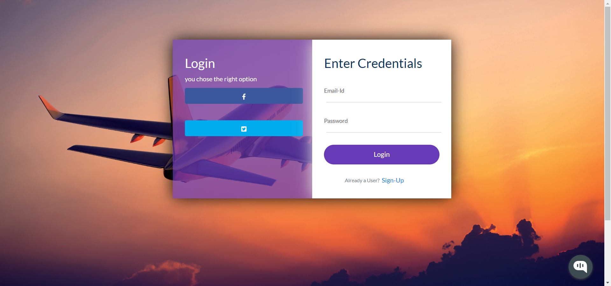

# MERN-Flight-Booking-Application

A complete flight booking application made using MERN Stack (MongoDB, Express js, React js, Node js)

The Flight ticket booking app is composed of the following Features:

### Front-End

* Sign-In & Sign-Up Pages.

* Uses Token based system, so only registered users can access the website  passport js.

* Password hashing using passport js.

* Has a profile page, which will display all information about the signed in user.

* List of cities for users to choose from (starting city & destination city). 

* Getting list of flight's of different airlines with various details.

* Seat selection page has a very user friendly environment, which also generates dynamic forms for storing data's of passengers.

* Has a Confirmation page, which gets a debit card data using react-credit-cards. This version of the application does not include handling the payment process. 

* Final page has a boarding pass displaying component, it displays all passenger data and also generates a random number as a transaction ID.

* Ticket Cancellation page will cancel the ticket which was booked.

* Also has an integrated ai chatbot

### Back-End

* Uses Express js based application for the backend process.

* Uses MongoDB atlas for storing the collections.

* Uses passport js for authenticating user and token based system.

* Uses passport js for hashing the password before sending the data to the cloud.

* This version does not support dynamic seat data being stored from cloud.

This project also demonstrates:

* a typcial React project layout structure

**Screenshots:**
Landing Page:

Signing In Page:

✈️ Flight Booking Application (MERN Stack)

A full-stack Flight Booking web application built using React, Node.js, Express, and MongoDB (local).
This setup runs entirely on a self-hosted Ubuntu VM without MongoDB Atlas or environment files.

🧱 Tech Stack

Frontend: React, Axios, Material-UI, Bootstrap

Backend: Node.js, Express, Passport-JWT

Database: MongoDB (Local)

Auth: JWT (JSON Web Token)

📁 Project Structure
Flight-Booking-App/
├── backend/
│   ├── app.js
│   ├── bin/www
│   ├── routes/
│   ├── models/
│   ├── config/keys.js
│   └── package.json
└── frontend/
    ├── src/
    ├── public/
    └── package.json

🚀 Deployment Guide (Ubuntu)
1️⃣ Install Node.js (v18)
curl -fsSL https://deb.nodesource.com/setup_18.x | sudo -E bash -
sudo apt install -y nodejs
node -v
npm -v

2️⃣ Install MongoDB (Local)

Import MongoDB GPG Key

curl -fsSL https://pgp.mongodb.com/server-7.0.asc | \
sudo gpg -o /usr/share/keyrings/mongodb-server-7.0.gpg --dearmor

Add MongoDB Repository

echo "deb [ signed-by=/usr/share/keyrings/mongodb-server-7.0.gpg ] \
https://repo.mongodb.org/apt/ubuntu jammy/mongodb-org/7.0 multiverse" | \
sudo tee /etc/apt/sources.list.d/mongodb-org-7.0.list

Install MongoDB

sudo apt update
sudo apt install -y mongodb-org

Start MongoDB

sudo systemctl start mongod
sudo systemctl enable mongod

Verify:

mongosh

3️⃣ Backend Setup
cd ~/Flight-Booking-App/backend
npm install
npm install -g nodemon

MongoDB Config

backend/config/keys.js

module.exports = {
  MongoURI: "mongodb://127.0.0.1:27017/flightapp"
};

Start Backend
npm run devStart

Backend runs on:

http://localhost:8080

4️⃣ Frontend Setup
cd ~/Flight-Booking-App/frontend
npm install
export NODE_OPTIONS=--openssl-legacy-provider
npm start

Frontend runs on:

http://localhost:3000

🔐 Authentication Flow

Register: POST /register

Login: POST /login

JWT Token returned on login

Protected routes use Passport-JWT
